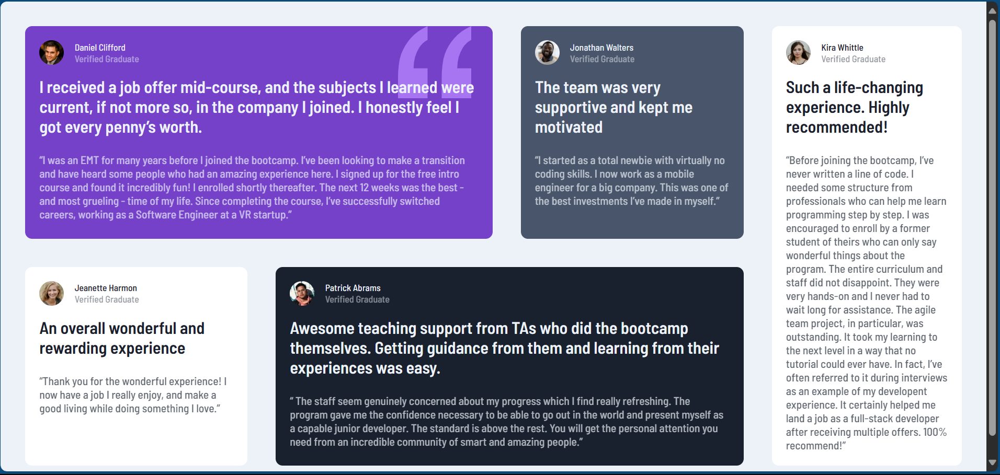

# Frontend Mentor - Testimonials grid section solution

This is a solution to the [Testimonials grid section challenge on Frontend Mentor](https://www.frontendmentor.io/challenges/testimonials-grid-section-Nnw6J7Un7). Frontend Mentor challenges help you improve your coding skills by building realistic projects. 

## Table of contents

- [Overview](#overview)
  - [The challenge](#the-challenge)
  - [Screenshot](#screenshot)
  - [Links](#links)
- [My process](#my-process)
  - [Built with](#built-with)
  - [What I learned](#what-i-learned)
  - [Continued development](#continued-development)
- [Author](#author)

## Overview

### The challenge

Users should be able to:

- View the optimal layout for the site depending on their device's screen size

### Screenshot

### Links

- Solution URL: [Solution URL](https://github.com/Aniket200-ind/testimonial-grid-section)
- Live Site URL: [Live site URL](https://testimonialgrid-section.vercel.app/)

## My process

### Built with

- Svelte: [Svelte](https://svelte.dev/)
- Vite: [Vite](https://vitejs.dev/)
- Semantic HTML5 markup
- CSS Grid
- Mobile-first workflow

### What I learned

I learned how to use CSS grid and how to make a responsive website using Svelte.
I have used Svelte for first time and it was great to learn how to use it.

### Continued development

I want to learn more about Svelte and how to use it in future projects.

## Author

- GitHub - [Aniket200-ind](https://github.com/Aniket200-ind)
- Frontend Mentor - [@Aniket200-ind](https://www.frontendmentor.io/profile/Aniket200-ind)
- Twitter - [@AniketBotre2604](https://twitter.com/AniketBotre2604)